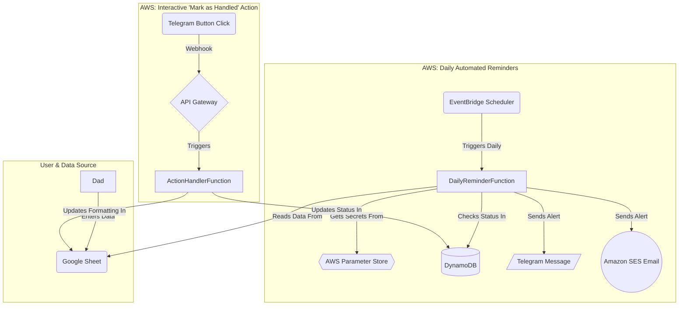

# serverless-financial-reminder-bot
Serverless Financial Reminder Bot
A multi-cloud, serverless application designed to send automated, intelligent reminders for personal financial deadlines. This project reads data from a Google Sheet, processes it using AWS Lambda, and sends timely notifications via Telegram and Amazon SES.

About The Project
This project was created to solve a real-world problem: tracking various financial deadlines (maturing investments, bill due dates, document expiries) which are often managed in disparate places or simple spreadsheets. The goal was to build an automated, "set it and forget it" system that provides proactive, detailed, and actionable reminders without requiring manual intervention.

The system is built entirely on serverless technologies, ensuring it is highly scalable, requires zero server management, and runs at virtually no cost under the free tiers of AWS and Google Cloud.

Project Philosophy: Control and Simplicity
This project was designed with two core principles in mind, differentiating it from standard calendar apps or commercial financial tools.

1. Direct Spreadsheet Integration
Instead of a rigid app interface, this system uses a simple Google Sheet as its "database." This is ideal for financial data, allowing for easy bulk entry, customization, and a familiar, powerful interface for managing records without being constrained by a specific app's design.

2. Absolute Data Privacy & Control
Unlike many financial tracking apps that require linking bank accounts or storing sensitive data on third-party servers, this architecture ensures the user has absolute control. The core financial data lives only in the user's private Google Sheet. The backend logic runs on a private cloud account and only processes the data for notifications, without storing it long-term. This provides a level of privacy that commercial apps cannot match.

Core Features
Centralized Data Management: Uses a simple Google Sheet as a user-friendly "database".
Multi-Channel Notifications: Sends alerts via both Telegram for instant notifications and Amazon SES for detailed, archivable emails.
Intelligent, Proactive Reminders:
Sends reminders on user-defined advance schedules (e.g., 180, 30, 7, and 0 days before an event).
Automatically detects and flags overdue items.
Dynamic & User-Friendly Spreadsheet:
The spreadsheet uses dropdowns, calendar pickers, and a custom onEdit script for a dynamic, error-proof data entry experience.
Secure and Scalable Backend:
Built with a serverless-first approach on AWS.
Securely manages credentials using AWS Systems Manager Parameter Store.
Uses Amazon DynamoDB to track the status of reminders for future interactive features.
Tech Stack & Architecture
This project integrates services from AWS and Google Cloud Platform to create a robust, event-driven application.

Tech Stack:

Backend Logic: Python 3.11+
Cloud Provider (Compute/DB): Amazon Web Services (AWS)
Data Source: Google Cloud Platform (GCP)
Key Services:
AWS Lambda, Amazon EventBridge, Amazon DynamoDB, AWS Systems Manager Parameter Store, Amazon SES, Amazon S3, Amazon API Gateway
Google Sheets API, Google Drive API, Google Apps Script
Telegram Bot API
Architecture Diagram
The system is orchestrated by a daily scheduled event that triggers the main Lambda function. This function then coordinates with all other services to read, process, and send notifications.

Future Scope & Alternatives
The Self-Hosted, Privacy-First Model
For users with maximum privacy concerns, the cloud-based nature of this project is not a requirement. The entire architecture could be replicated locally with minimal changes:

Compute: The AWS Lambda function logic could run as a simple Python script on a home server, like a Raspberry Pi or an old laptop.
Trigger: A standard cron job would replace the Amazon EventBridge scheduled trigger.
Data Source: The Google Sheet could be replaced with a local Microsoft Excel or CSV file.
Notifications: The only internet-facing components would be the outbound notification API calls to Telegram and an email service.
This self-hosted model demonstrates the flexibility of the core logic and provides a path for users who wish for their data to never leave their home network.

Project Setup & Deployment
To replicate this project, you would need to configure three main areas:

1. Google Cloud & Spreadsheet Setup
Create a Google Cloud Platform (GCP) project.
Enable the Google Sheets and Google Drive APIs.
Create a Service Account, grant it Editor permissions, and download its JSON credentials key.
Create the user-facing Google Sheet with the specified columns and Quality-of-Life features (Data Validation, Conditional Formatting, Apps Script).
Share the Google Sheet with the Service Account's email address, giving it Editor access.
2. AWS Backend Setup
Create a DynamoDB table to store reminder statuses.
Store the downloaded Google Service Account JSON key in AWS Systems Manager Parameter Store as a SecureString.
Create an IAM Lambda execution role with permissions to access DynamoDB, Parameter Store, and SES.
Verify a sender email address in Amazon SES. For full functionality, request production (out-of-sandbox) access for the AWS account.
3. Lambda Deployment
The Python code is structured in a single app.py file containing handler functions.
Create the necessary Lambda functions in the AWS console.
Package the Python script along with its dependencies (gspread, requests, etc.) into a .zip file and upload it to an S3 bucket.
Deploy the code to Lambda from the S3 bucket.
Configure the Lambda functions with the appropriate handler settings (e.g., app.daily_reminder_handler) and set environment variables for configuration (Sheet ID, API tokens, etc.).
Set up an Amazon EventBridge rule to trigger the main function on a daily schedule.
(Optional) Set up Amazon API Gateway to create an HTTP endpoint to trigger handler functions for interactive features.